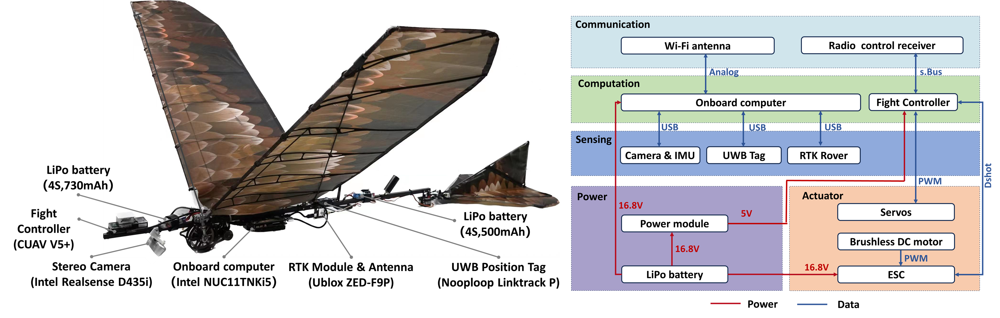

# FWAF-VID: A Flapping-Wing Aggressive Flight Benchmark Dataset for Visual-Inertial Localization  

The detailed features of the **FWAF-VID dataset** can be found in our paper: **“FWAF-VID: A Flapping-Wing Aggressive Flight Benchmark Dataset for Visual-Inertial Localization    ”** by Jizhou Jiang, Erzhen Pan, Wenfu Xu, Wei Sun, and Jingyang Ye, which is  a submission for RAL.

Created by Jizhou Jiang, you can contact me through E-mail：22B953004@stu.hit.edu.cn

## Video 

[Video1: Overall introduction of FWAF-VID](https://youtu.be/vGuUdbBSFHQ)

[Video2: The outdoor flight video of dataset collection](https://youtu.be/rR8PX4HdsLE)

[Video3: The indoor flight video of dataset collection]( https://youtu.be/ttBQ6Z0jIeU)

[Video4: The static flapping video of dataset collection](https://youtu.be/gj0VYW6XMt8)

## The Platform ：HIT-Hawk

The platform and sensor configuration of the eagle-like large-scale flapping-wing aerial vehicle **HIT-Hawk**, with a wingspan of 1.80 meters and body weight of 770 grams, it can continuously autonomous flight for a maximum of 180 minutes while carrying payload equivalent to 100% of its weight, with a takeoff weight of 1550 grams.

## ROS Topic (Synchronized)

|      | Description                                                  | Topic                         | Type                            |
| :--: | :----------------------------------------------------------- | ----------------------------- | ------------------------------- |
|  1   | Realsense D435 depth image                                   | /camera/depth/image_rect_raw  | sensor_msgs/Image               |
|  2   | Realsense D435 left gray image                               | /camera/infra1/image_rect_raw | sensor_msgs/Image               |
|  3   | Realsense D435 right gray image                              | /camera/infra2/image_rect_raw | sensor_msgs/Image               |
|  4   | Realsense D435 color image                                   | /camera/color/image_raw       | sensor_msgs/Image               |
|  5   | The build-in IMU of D435i                                    | /camera/imu                   | sensor_msgs/Imu                 |
|  6   | The filltered fusion IMU data from CUAV V5+                  | /mavros/imu/data              | sensor_msgs/Imu                 |
|  7   | Ephemeris data for GLONASS (GLO) satellites                  | /ublox_driver/glo_ephem       | gnss_comm/GnssGloEphemMsg       |
|  8   | Range measurement data of RTK                                | /ublox_driver/range_meas      | gnss_comm/GnssMeasMsg           |
|  9   | The latitude, longitude, and altitude coordinates of the receiver (LLA stands for Longitude, Latitude, and Altitude) | /ublox_driver/receiver_lla    | sensor_msgs/NavSatFix           |
|  10  | The Position, Velocity, and Time (PVT) data of the RTK receiver | /ublox_driver/receiver_pvt    | gnss_comm/GnssPVTSolnMsg        |
|  11  | The data related to time pulse information in the u-blox driver | /ublox_driver/time_pulse_info | gnss_comm/GnssTimePulseInfoMsg  |
|  12  | Linktrack P UWB positioning tag data（trasn. and rota.）     | /nlink_linktrack_tagframe0    | nlink_parser/LinktrackTagframe0 |

## Dataset Sequences list

- We provide the option to download the raw dataset  and the corresponding extracted motion trajectory files, both saved in rosbag format. 
- The download links for each sequence and trajectory are attached in the table. If the links in the table cannot be directly opened, download readme file and copy the corresponding cloud storage link and paste it into your browser. 
- If neither of these methods works, we also provide links to the cloud storage containing all the datasets: [Quark cloud link](https://pan.quark.cn/s/6ed823d41de0)

|  #   |                       sequences (link)                       |    camera perspective     | illumination |                       trajectory(link)                       | length(m) | duration(s) | max ground speed(m/s) | air speed(m/s) | groundtruth |   level   |
| :--: | :----------------------------------------------------------: | :-----------------------: | :----------: | :----------------------------------------------------------: | :-------: | :---------: | :-------------------: | :------------: | :---------: | :-------: |
|  1   |      [Outdoor_01](https://pan.quark.cn/s/a176ecdb9dcd)       | 45 degree downward facing | bright scene |         [oval](https://pan.quark.cn/s/2c497376fac8)          |  910.18   |     156     |         12.02         |      0.36      |      ✔      |  medium   |
|  2   |      [Outdoor_02](https://pan.quark.cn/s/88513081e6f9)       | 45 degree downward facing | bright scene |         [oval](https://pan.quark.cn/s/e654374c453d)          |  839.24   |     150     |         13.40         |      0.39      |      ✔      |  medium   |
|  3   |      [Outdoor_03](https://pan.quark.cn/s/2e671803ab9e)       |      Forward  facing      | bright scene |         [oval](https://pan.quark.cn/s/a2f07f9a35ea)          |  1150.60  |     197     |         13.47         |      1.59      |      ✔      | difficult |
|  4   |      [Outdoor_04](https://pan.quark.cn/s/4badfa1e3cc8)       | 45 degree downward facing | bright scene |      [8-character](https://pan.quark.cn/s/6415f87b77a9)      |  808.28   |     159     |         10.04         |      1.68      |      ✔      |  medium   |
|  5   |      [Outdoor_05](https://pan.quark.cn/s/4b0f4afa33f8)       | 45 degree downward facing | bright scene |      [8-character](https://pan.quark.cn/s/03ed33708d70)      |  963.88   |     155     |         11.74         |      1.53      |      ✔      |  medium   |
|  6   |      [Outdoor_06](https://pan.quark.cn/s/cf41e2edac14)       |      Forward  facing      | bright scene |      [8-character](https://pan.quark.cn/s/b0bc2f87f21f)      |  575.89   |     125     |         11.09         |      1.75      |      ✔      | difficult |
|  7   |      [Outdoor_07](https://pan.quark.cn/s/fd8b2cdf1822)       | 45 degree downward facing | bright scene | [Fast Flapping and Gliding Switch](https://pan.quark.cn/s/d033837a3f6c) |  377.71   |     67      |         12.29         |      1.62      |      ✔      |  medium   |
|  8   |      [Outdoor_08](https://pan.quark.cn/s/a2c003ba35b5)       |      Forward  facing      | bright scene | [Fast Flapping and Gliding Switch](https://pan.quark.cn/s/b5b16b3f5ea0) |  104.10   |     41      |         9.87          |      1.64      |      ✔      |  medium   |
|  9   |      [Outdoor_09](https://pan.quark.cn/s/d90d8e54409b)       | 45 degree downward facing | dark  scene  |                            random                            |   78.15   |     26      |         8.34          |      1.34      |      ✔      | difficult |
|  10  |      [Outdoor_10](https://pan.quark.cn/s/86f89110fb4d)       | 45 degree downward facing | dark  scene  |                            random                            |  105.86   |    31.5     |         7.87          |      1.47      |      ✔      | difficult |
|  11  |      [Outdoor_11](https://pan.quark.cn/s/d94616bb429b)       |      Forward  facing      | dark  scene  |                            random                            |   94.31   |    34.4     |         8.92          |      1.44      |      ✔      | difficult |
|  12  |      [Outdoor_12](https://pan.quark.cn/s/6ae1433a1104)       |      Forward  facing      | dark  scene  |                            random                            |   98.82   |     69      |         9.27          |      1.51      |      ✔      | difficult |
|  13  |       [Indoor_13](https://pan.quark.cn/s/a176ecdb9dcd)       | 45 degree downward facing | bright scene |         [oval](https://pan.quark.cn/s/08baf75cba0a)          |   43.25   |    17.6     |         8.94          |      NaN       |      ✔      |  medium   |
|  14  |       [Indoor 14](https://pan.quark.cn/s/13da836478cf)       | 45 degree downward facing | bright scene |         [oval](https://pan.quark.cn/s/1f5645dbc845)          |  163.44   |    36.3     |         12.17         |      NaN       |      ✔      | difficult |
|  15  |       [Indoor 15](https://pan.quark.cn/s/8ff207e19441)       |      Forward  facing      | bright scene |         [oval](https://pan.quark.cn/s/b82f1bfc5536)          |   83.34   |    29.3     |         8.81          |      NaN       |      ✔      | difficult |
|  16  |       [Indoor 16](https://pan.quark.cn/s/45fcd10333fe)       | 45 degree downward facing | dark  scene  |        [random](https://pan.quark.cn/s/7a72ac536e98)         |   55.28   |    13.4     |         11.85         |      NaN       |      ✔      | difficult |
|  17  |       [Indoor 17](https://pan.quark.cn/s/bafbca7367c8)       |      Forward  facing      | dark  scene  |        [random](https://pan.quark.cn/s/cb078b250cb6)         |   51.14   |    14.6     |         11.99         |      NaN       |      ✔      | difficult |
|  18  |  [Static flapping 18](https://pan.quark.cn/s/46942b374fc3)   |      Forward  facing      | bright scene |                      oscillatory motion                      |    NaN    |     92      |         2.12          |      NaN       |      ✔      | difficult |
|  19  |  [Static flapping 19](https://pan.quark.cn/s/057a5fc65551)   |      Forward  facing      | bright scene |                      oscillatory motion                      |    NaN    |     118     |         1.67          |      NaN       |      ✔      |  medium   |
|  20  |  [Static flapping 20](https://pan.quark.cn/s/971827e29195)   |      Forward  facing      | bright scene |                      oscillatory motion                      |    NaN    |     92      |         1.12          |      NaN       |      ✔      |   easy    |
|  21  |  [Static flapping 21](https://pan.quark.cn/s/b876bb9de731)   | 45 degree downward facing | bright scene |                      oscillatory motion                      |    NaN    |     75      |         2.72          |      NaN       |      ✔      | difficult |
|  22  |  [Static flapping 22](https://pan.quark.cn/s/a4de13fdb516)   | 45 degree downward facing | bright scene |                      oscillatory motion                      |    NaN    |     84      |         2.64          |      NaN       |      ✔      | difficult |
|  21  |     [Calibr Camera](https://pan.quark.cn/s/02d0c8bfbc44)     |            NaN            | bright scene |                             NaN                              |    NaN    |    52.8     |          NaN          |      NaN       |     NaN     |    NaN    |
|  22  |      [Calibr AHRS](https://pan.quark.cn/s/cd53e8aceb9a)      |            NaN            | bright scene |                             NaN                              |    NaN    |    10460    |          NaN          |      NaN       |     NaN     |    NaN    |
|  23  |  [Calibr AHRS+Camera](https://pan.quark.cn/s/f9cee859b8f8)   |            NaN            | bright scene |                             NaN                              |    NaN    |     64      |          NaN          |      NaN       |     NaN     |    NaN    |
|  24  | [Calibr AHRS+Camera_45degree](https://pan.quark.cn/s/c6cf07e7df5a) |            NaN            | bright scene |                             NaN                              |    NaN    |    47.7     |          NaN          |      NaN       |     NaN     |    NaN    |
|  25  |   [Calibr IMU+Camera](https://pan.quark.cn/s/2f177add7759)   |            NaN            | bright scene |                             NaN                              |    NaN    |     67      |          NaN          |      NaN       |     NaN     |    NaN    |
|  26  |      [Calibr IMU](https://pan.quark.cn/s/62e57a448e1c)       |            NaN            | bright scene |                             NaN                              |    NaN    |    62224    |          NaN          |      NaN       |     NaN     |    NaN    |

## Dataset format 

The dataset comprises a total of 12 large-scale, long-duration outdoor aggressive flight sequences, 5 indoor flight sequences, 4 static flapping sequences, and 5 calibration sequences, all stored in rosbag format on the onboard computer. The rosbag file of the dataset is processed using script files to calculate ground truth and extract sensor data topics separately. The data is then saved in the TUM format for subsequent benchmark comparisons. Ground truth and estimated data are aligned through a similarity transformation sim (3).

├── Outdoor

│  ├── Outdoor_01-12.bag

│  ├── bag2tum.py

│  ├── bag2gt.py

│  └── trajectory_Outdoor_01-12_traj.bag

├── Indoor

│  ├── Indoor_13-17.bag

│  ├── bag2gt.py

│  ├── bag2tum.py

│  ├── covert.py

│  └── kalman_filter.py

├── Static_flapping

│  ├── Calibr_Camera_d435i_21.bag

│  ├── Static_flapping_18.bag

│  ├── Static_flapping_19.bag

│  ├── Static_flapping_20.bag

├── Calibr

│  ├── camera_imu.yaml

│  ├── checkerboard.yaml

│  ├── CUAV V5+imu_param.yaml

│  ├── imu.yaml

│  ├── Calibr_Imu_22.bag

│  ├── Calibr_joint_AHRS+Camera_23.bag

│  ├── Calibr_joint_AHRS+Camera45degree_24.bag

│  ├── Calibr_joint_build-in imu+Camera_25.bag

│  └── Calibr_imu_26.bag

## Benchmark comprasion

In our letter, we compared a total of four SOTA stereo VIO frameworks, the corresponding GitHub links are as follows. If you need to compare other algorithms, you can configure the algorithm based on the calibrate datasets. [Rpg_trajectory_evaluation tools](https://github.com/uzh-rpg/rpg_trajectory_evaluation.git) was used to evaluate trajectory consistency and estimate errors.

1.ORB-SLAM3 [UZ-SLAMLab/ORB_SLAM3: ORB-SLAM3: An Accurate Open-Source Library for Visual, Visual-Inertial and Multi-Map SLAM (github.com)](https://github.com/UZ-SLAMLab/ORB_SLAM3)

2.VINS-FUISON [HKUST-Aerial-Robotics/VINS-Fusion: An optimization-based multi-sensor state estimator (github.com)](https://github.com/HKUST-Aerial-Robotics/VINS-Fusion)

3.MSCKF-VIO [KumarRobotics/msckf_vio: Robust Stereo Visual Inertial Odometry for Fast Autonomous Flight (github.com)](https://github.com/KumarRobotics/msckf_vio)

4.GVINS [HKUST-Aerial-Robotics/GVINS: Tightly coupled GNSS-Visual-Inertial system for locally smooth and globally consistent state estimation in complex environment. (github.com)](https://github.com/HKUST-Aerial-Robotics/GVINS)

## Requirement(recommend)

To ensure the proper functioning of the dataset, we recommend the following environmental configuration.If you need to run a VIO (Visual-Inertial Odometry) algorithm, please refer to its corresponding requirements.

1.ROS 20.04 Noetic full-desktop

2.Onboard-sensors SDK(sensor configuration file)

3.Python 3.8 & 2.7

